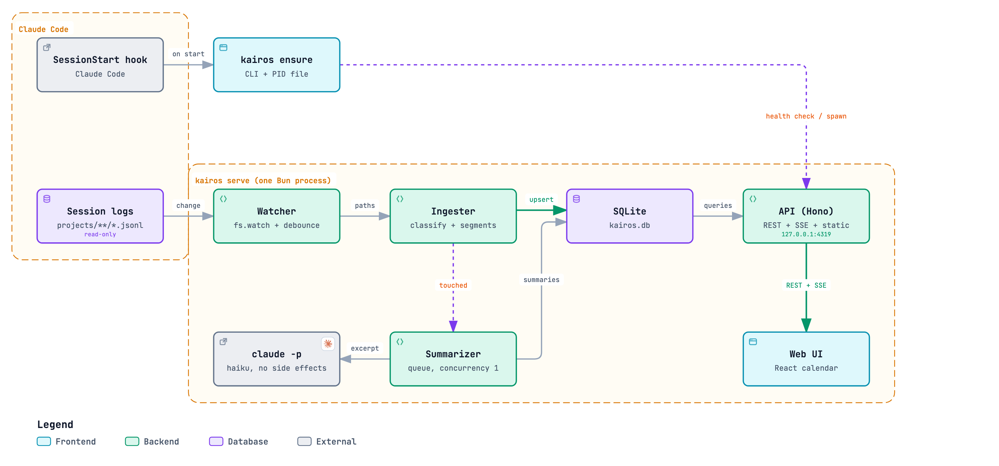
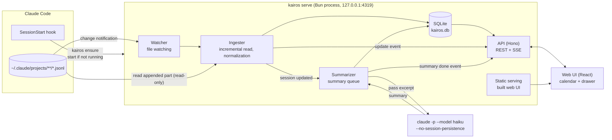
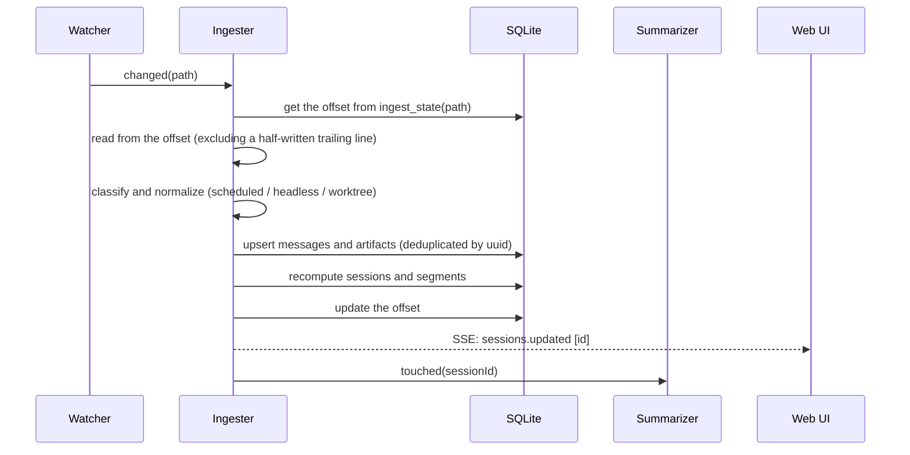
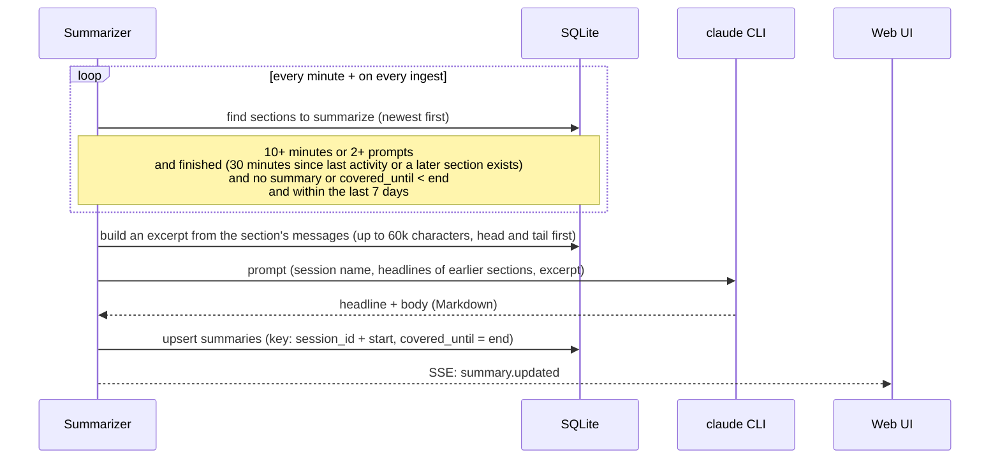
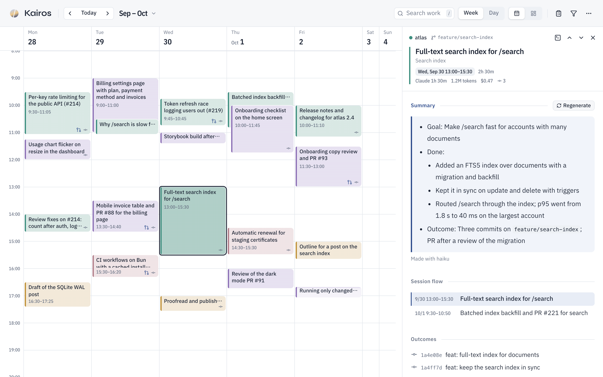
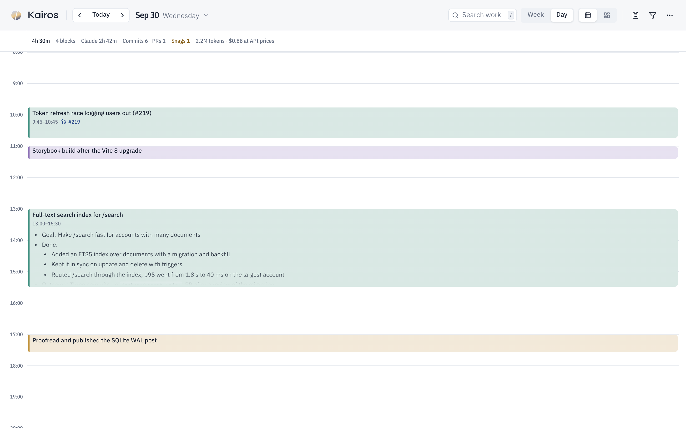
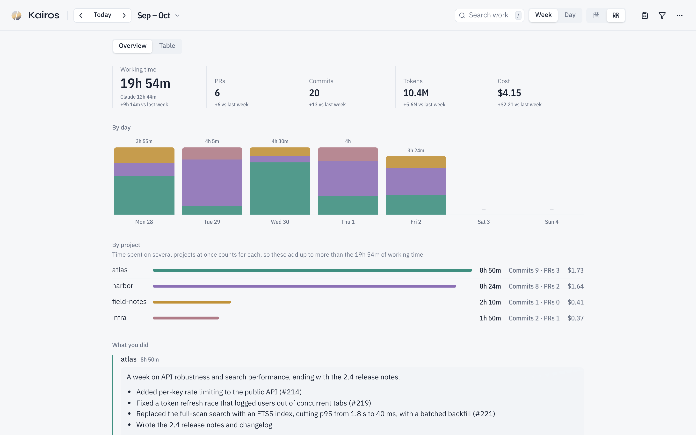

# Kairos Architecture

Last updated: 2026-10-05 / Related: [README](README.md) / [Design](DESIGN.md)

## 1. Overview



The image is rendered with [Archify](https://github.com/tt-a1i/archify) from [`docs/images/architecture.archify.json`](docs/images/architecture.archify.json); the Mermaid chart below has the full set of flows.



There is only one process, `kairos serve`, which handles ingest, summaries, the API and static serving together.

## 2. Components

| Component | Responsibility | Main implementation |
|---|---|---|
| Launcher | `kairos ensure`: checks `/api/health` and, if there's no response, starts `kairos serve` detached. A PID file prevents double starts | `src/cli` |
| Watcher | Watches `~/.claude/projects` recursively and hands changed jsonl files to the Ingester. Bursts of changes are coalesced (debounce) | `fs.watch` (recursive) |
| Ingester | Reads only the appended part from the offset in `ingest_state`. A half-written trailing line is left for next time. Classifies, normalizes and stores records | `src/server/ingest` |
| Segmenter | Builds work blocks from the activity times of human-initiated turns (split at 15 minutes), dropping blocks with neither a request nor a tool call. Recomputed on every session update | `src/server/ingest/segments.ts` |
| Summarizer | Queues sessions that need summaries and runs `claude -p` one at a time | `src/server/summarize` |
| API | REST for the calendar, details, conversations, summaries and project settings, plus SSE for update notifications | Hono |
| Web UI | Week and day calendar, detail drawer, filters (projects, keywords, etc.). English by default, Japanese selectable (`src/web/src/i18n`) | React + Tailwind + shadcn/ui |

Everything is TypeScript on Bun: Hono for the API, SQLite through `bun:sqlite`, React + Vite with Tailwind CSS and shadcn/ui for the UI, file watching + Server-Sent Events for live updates, and the `claude` CLI as a subprocess for summaries. The calendar is drawn with CSS Grid rather than a library, so its look can be tuned freely. API types in `src/shared` are shared by the server and the UI.

The schema lives in `MIGRATIONS` in `src/server/db/index.ts`. A continued session starts with a copy of the previous session's conversation under the same uuids, so message uniqueness is per session, and copies are flagged with `is_copy` and left out of aggregates.

## 3. Ingest flow



### 3.1 Normalization rules

| Rule | Criterion |
|---|---|
| Human prompt | `type=user` and `origin.kind=human` (any `promptSource`; `sdk` is also human input, e.g. from the desktop app). Includes slash commands |
| Automatic-run turn | From a user record with `turnOrigin=scheduled` until the next human prompt. Set `messages.is_scheduled=1` and exclude from work-block computation. `task-notification` and `peer` don't change how a turn is treated |
| Headless session | Zero human prompts. Not shown on the calendar |
| Prompt-less work block | A block with no human prompt, `/loop` tick or tool call (a compaction, an API error or a short reply to a notification after a break) isn't drawn. Prompt-less blocks with tool calls stay: Claude acting on a notification on its own |
| Worktree | If the launch cwd is `<repo>/.claude/worktrees/<name>`, the project is `<repo>` and `<name>` becomes a secondary label. A later `relocated` / `worktree-state` only affects the secondary label |
| Same repository | If `.git/config` has an `origin` remote, the project is named after the repository and other clones of the same remote merge into it (a directory name that differs becomes the secondary label). Only the file is read; no git commands run |
| Title | `custom-title` > `agent-name` > `ai-title` > the first human prompt |
| Recap | Store `system/away_summary` and use it as a placeholder until the AI summary is ready |
| Tool output | Truncated to the first 4KB |
| Thinking and images | Not stored |
| Commit | A successful Bash call containing `git commit` |
| PR | A `pr-link` record. The title comes from `--title` of `gh pr create` and is linked by the URL in the result's `gitOperation.pr` |
| Token usage | Store the assistant record's `message.usage` in `usage`, one row per `message.id` (with the maximum `output_tokens`). Subagent usage goes into the parent session. Returned per work block as the sum within its time range |
| Activity | Counted from messages and artifacts within the work block's time range: outcomes (commits and PRs, up to 5 minutes after the end), files edited (distinct targets of Edit / Write, etc.), tool calls, subagents, stumbles (tool errors, interrupts, API errors), conversation compactions |
| Claude's working time and effort | Store `durationMs` of `system/turn_duration` in `turns`, and the response's `effort` in `usage.effort`. Copies in continued sessions are excluded by uuid |
| Cost | An estimate converted with the API price list (`src/server/pricing.ts`). It won't match what you actually pay when using a subscription |

The evidence for each rule and the fixture for each rule are collected in [tests/fixtures/README.md](tests/fixtures/README.md).

The parser has a `PARSER_VERSION`. Files whose `ingest_state.parser_version` doesn't match are re-read if the original log still exists.

## 4. Summary flow

Summaries are per section (one calendar block). With real data, a single session splits into as many as 15 blocks, so per-session summaries would repeat the same headline.



- Concurrency is 1. On failure the reason is recorded and it retries up to 3 times after 1, 2 and 4 minutes
- For short sections (under 10 minutes and at most one prompt), only a headline is generated automatically. The body is stored in `summaries` as an empty string and returned by the API as no summary (`body: null`)
- The body of short sections and sections older than 7 days can be pushed to the priority queue with the button in the drawer (`POST /api/sessions/:id/sections/:start/summary`)
- Sections without a headline (older than 7 days, in progress, not yet generated) show `segments.fallback_title`, computed at ingest (the first prompt, or failing that the first line of Claude's last reply)
- The summary language follows the UI language: the UI sends it with `PATCH /api/settings` and the server keeps it in `kv` (`summary_lang`), so it survives restarts from the SessionStart hook. Starting with `--summary-lang <en|ja>` fixes it and the UI's choice is ignored. Without either, English. Changing it doesn't touch existing summaries or recaps; they can be regenerated
- `claude` runs in a dedicated working directory with `--no-session-persistence`, `--tools ""`, `--strict-mcp-config` and `--setting-sources project` to eliminate side effects

### 4.1 Recaps

A recap explains what was done on one project during a shown period (the summary view's week or day) in a few sentences and bullets, for a weekly report or for looking back.

- Written only on request (the summary view's "Explain this work" button, `POST /api/recaps`), never automatically: a week has as many recaps as projects
- The input is the period's section headlines and summary bodies (sections starting in the period, from sessions with prompts), plus the PR and commit titles made during them, up to 40k characters (bodies are dropped first). Raw conversation is not read again
- Stored in `recaps` (key: project + period start and end) with a hash of the input. When the input changes (more work, a new section summary), the API marks the recap `stale`, and it can be rewritten
- Shares the Summarizer's queue, so only one `claude` runs at a time: requested section summaries first, then recaps, then automatic section summaries. A failure is shown in the view until the next request (no automatic retry)
- Recaps cover the whole project in the period; the view's filters don't change them

## 5. API

| Method | Path | Description |
|---|---|---|
| GET | `/api/health` | Liveness check (used by the Launcher) |
| GET | `/api/calendar?from&to` | Sessions in the period and their sections (start, end, headline, summary body, PRs, prompt count, token usage, activity) |
| GET | `/api/search?q` | Sections matching every space-separated term across all periods, newest first (up to 50). Looks at headlines, summary bodies, session titles and branches, PR and commit titles, and the main conversation's prompts and replies. A plain `LIKE` scan (tens of ms on real data); queries under 2 characters return nothing |
| GET | `/api/spans?from&to` | Only the start, end and project of work blocks overlapping the period. Used for the "days with records" dots in the date picker; assigning to days is done in the UI's local time |
| GET | `/api/sessions/:id` | Session details (per-section summaries, artifacts, subagents) |
| GET | `/api/sessions/:id/messages?cursor&limit` | Paginated conversation |
| GET | `/api/settings` | Summary language and whether `--summary-lang` fixes it |
| PATCH | `/api/settings` | `{ summaryLang }`: the UI's language, used for new summaries and recaps |
| GET | `/api/recaps?from&to` | Recaps of every project with work starting in the period, written or not (body, stale, pending, error) |
| POST | `/api/recaps` | `{ projectId, from, to }`: push writing or rewriting a recap onto the queue (202; 404 without work in the period; 429 when 20 are already waiting) |
| POST | `/api/sessions/:id/sections/:start/summary` | Push generating or regenerating a section's summary onto the priority queue (202) |
| GET | `/api/projects` | List of projects (color, hidden flag) |
| PATCH | `/api/projects/:id` | Change color or hidden |
| GET | `/api/events` | SSE (`sessions.updated` / `summary.updated` / `recap.updated` / `ingest.progress`) |

Write routes (POST / PATCH) require `Content-Type: application/json` and the same Origin. Every request's Host header must be `127.0.0.1` or `localhost`.

Request and response types live in `src/shared` and are shared by the server and the frontend.

## 6. Screen layout



Toolbar on top, the calendar (or the summary) below it, and the detail drawer on the right. Day view, where tall blocks also show their summary body:



The summary layout: period totals against the previous period, time by day and by project, and per-project recaps:



The screenshots are taken from a fictional week (`scripts/screenshots/demo.ts`) with `bun run screenshots`; retake them when the UI changes visibly.

- Blocks that overlap in time are placed side by side, as in Google Calendar
- Blocks show the summary headline. If there isn't enough height, only the headline is shown, with the full text on hover. Blocks with commits or PRs carry a small mark
- In the week view, days running several sessions in parallel get more width. If lanes would still be too narrow (e.g. with the drawer open), the selected day and its neighbors keep their width
- In the day view, tall blocks also show the worktree name, PR numbers and the summary body
- The search field filters the shown period and, while focused, lists matching work from every period; picking one jumps there
- The drawer is synced with the URL (`?session=`) and stays open across reloads
- The layout toggle switches between calendar and summary (`?layout=`, `c` / `s`). The summary has an overview tab and a table tab (`?layout=list`, `l`; the per-block table that used to be the list layout, keeping its own scroll and sticky header). The summary is computed in the browser from the same `/api/calendar` response (`src/web/src/lib/summary.ts`), plus the previous period's response for the change under each number, so it needs no API of its own

## 7. Directory layout

```
kairos/
├── .claude/            # Claude Code setup: path-scoped rules, hooks, skills, agents
├── docs/images/        # architecture diagram (rendered PNG and its Archify source)
├── ARCHITECTURE.md     # this file
├── DESIGN.md           # visual design for agents (DESIGN.md format)
├── scripts/            # check-jsdoc.ts; screenshots/ (fictional demo week and the capture)
├── src/
│   ├── cli/            # the kairos command (ensure / open / status / stop / restart / serve / ingest); daemon.ts
│   ├── server/
│   │   ├── db/         # schema and migrations
│   │   ├── ingest/     # watcher → reader → classify / records → ingester → segments; project, commits, prs
│   │   ├── summarize/  # summarizer (queue), digest (excerpt), prompt, claude (runs claude -p)
│   │   ├── api/        # Hono routes, SSE, security middleware
│   │   ├── queries.ts  # read queries behind the API
│   │   ├── pricing.ts  # API price list for cost estimates
│   │   └── serve.ts    # wires ingest, summaries and the API together
│   ├── shared/         # API types and constants
│   └── web/            # React app (Vite); i18n/ holds the UI messages
├── tests/fixtures/     # fictional jsonl logs generated by generate.ts (never copied from real logs)
└── package.json
```

## 8. Storage locations

| Kind | Path |
|---|---|
| DB | `~/Library/Application Support/kairos/kairos.db` |
| Log | `~/Library/Logs/kairos/server.log` |
| PID | `~/Library/Application Support/kairos/kairos.pid` |
| Working directory for summaries | `~/Library/Application Support/kairos/summarizer/` |

## 9. Performance

Measured on 2026-10-05 on an Apple M4 with 16 GB, Bun 1.3.11, against real logs: 1.0 GB in 645 jsonl files (1,068 files including subagent logs), 222 sessions, 117,869 messages.

| What | Result | How |
|---|---|---|
| First ingest (empty DB) | 7.9 s, peak memory about 580 MB | `kairos ingest --db <empty path>` under `/usr/bin/time -l` |
| Ingest on later starts | 0.1–0.2 s when nothing changed; about 1 s when a few files grew | `ingested … in` lines in `server.log` |
| DB size | 174 MB (about 17% of the logs) | file size after the first ingest |
| Server start until it answers | 0.18 s | `kairos ensure` until `/api/health` responds |
| `GET /api/calendar` for a busy week (92 KB) | 205 ms right after start, 30–45 ms after that | `curl -w %{time_total}` |
| `GET /api/sessions/:id` / `…/messages` for the largest session | 45 ms / 14 ms | same |
| Page open until the week's data is in | about 0.2 s (HTML parsed at 0.10 s, `/api/calendar` done at 0.20 s, `load` at 0.63 s once fonts arrive) | Navigation and Resource Timing in Chrome |

Start to display is well within the goal of showing the screen within 1 second, because the screen renders from the DB and ingest runs in the background. The first ingest is the slow part, and it happens once. The bundle is served uncompressed (JS 671 KB, CSS 569 KB); that costs nothing noticeable over loopback, so it is left as is.

## 10. Security

The server holds and returns conversations from every project, so it is treated as sensitive even though it only runs locally. Two things are assumed hostile: **other sites open in the same browser**, and **text inside the logs** (pasted web pages, tool output, anything Claude read).

| Threat | Defense | Where |
|---|---|---|
| Access from another machine | Listen on `127.0.0.1` only | `src/server/serve.ts` |
| DNS rebinding (a page whose domain resolves to `127.0.0.1` reads the API) | Reject any request whose Host header isn't `127.0.0.1` or `localhost` | `guardHost` in `src/server/api/security.ts` |
| CSRF (another page posts to the API) | Writes must be `Content-Type: application/json` — which a form or simple `fetch` can't send cross-origin without a preflight — and any Origin must be local. No CORS headers are ever sent | `guardWrite` |
| XSS from log text | Markdown is rendered with `react-markdown` defaults: no raw HTML, no `dangerouslySetInnerHTML`, no images | `src/web/src/components/Markdown.tsx` |
| Leaking to the outside by displaying a log (tracking pixels, remote fonts, scripts) | A CSP that allows only the app's own origin, plus `data:` images | `CSP` in `security.ts` |
| Prompt injection into summaries | `claude -p` gets no tools (`--tools ""`), no MCP servers (`--strict-mcp-config`), only project settings, an empty working directory, and the excerpt on stdin rather than in arguments or a shell. The worst a hostile log can do is spoil its own summary | `src/server/summarize/claude.ts` |
| Summaries showing up as sessions, or touching the logs | `--no-session-persistence`; Kairos never writes under `~/.claude` | same; a project hook blocks edits to `*.jsonl` |

GET routes and SSE have no side effects, so only the guarded write routes can change anything.

**What leaves the machine:** only the excerpts passed to `claude -p` for section summaries and recaps, sent through your own Claude Code login. Nothing else is fetched or sent.

Changes to any of this go through the `security-reviewer` agent (see `.claude/rules/api.md`).
