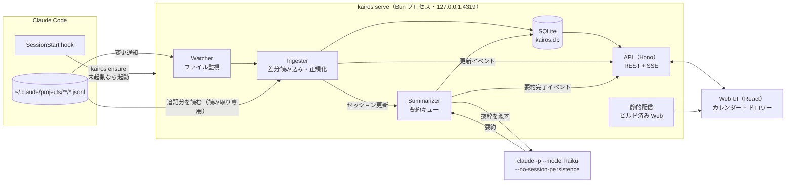
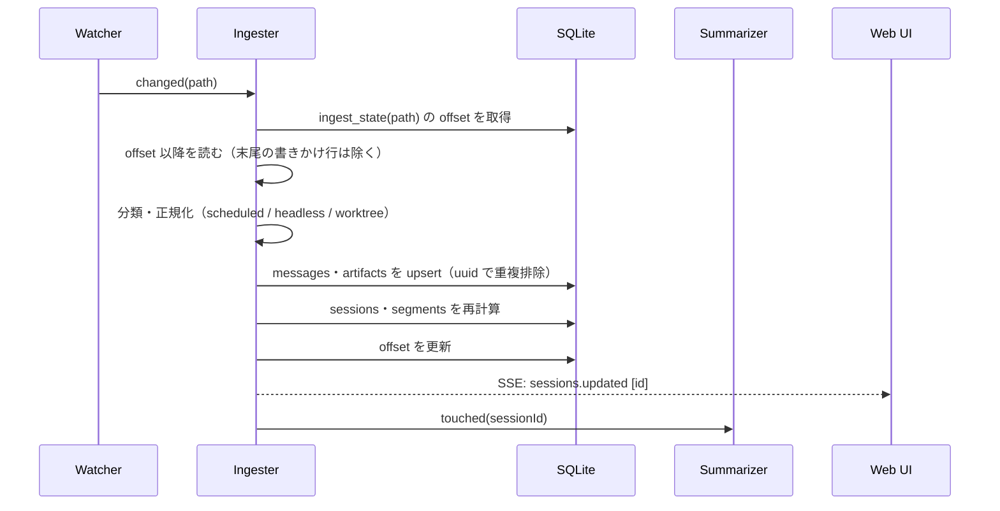
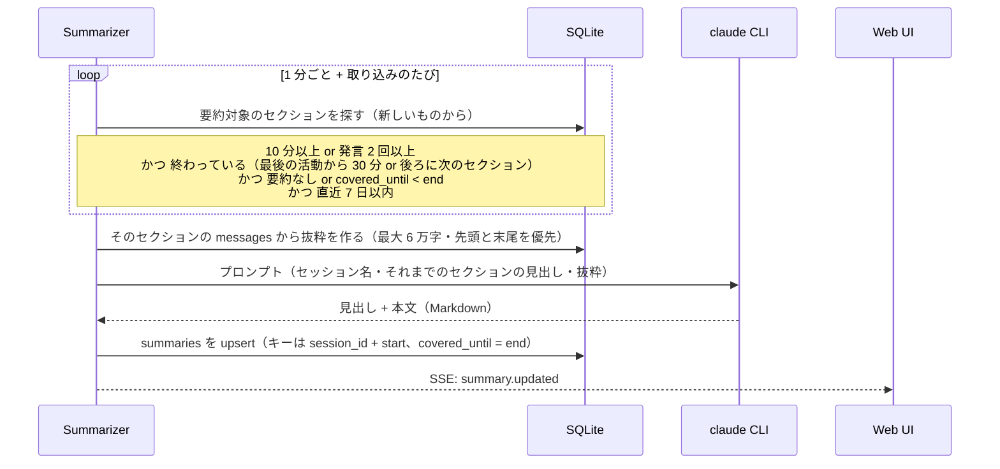

# Kairos 構成

最終更新: 2026-10-05 / 関連: [要件定義](requirements.md) / [タスク分解](tasks.md)

## 1. 全体像



プロセスは `kairos serve` 1 つだけで、取り込み・要約・API・静的配信をまとめて受け持つ。

## 2. コンポーネント

| コンポーネント | 責務 | 主な実装 |
|---|---|---|
| Launcher | `kairos ensure`: `/api/health` を確認し、応答がなければ `kairos serve` をデタッチ起動する。PID ファイルで二重起動を防ぐ | `src/cli` |
| Watcher | `~/.claude/projects` を再帰監視し、変更のあった jsonl を Ingester に渡す。短時間の連続変更はまとめる（debounce） | `fs.watch`（recursive） |
| Ingester | `ingest_state` の offset から追記分だけ読む。末尾の書きかけ行は次回に回す。レコードを分類・正規化して保存する | `src/server/ingest` |
| Segmenter | 人が起点のターンの活動時刻から作業ブロックを作る（15 分で分割）。セッション更新のたびに再計算する | `src/server/ingest/segments.ts` |
| Summarizer | 要約が必要なセッションをキューに積み、1 件ずつ `claude -p` を実行する | `src/server/summarize` |
| API | カレンダー・詳細・会話・要約・プロジェクト設定の REST と、更新通知の SSE | Hono |
| Web UI | 週・日のカレンダー、詳細ドロワー、絞り込み（プロジェクト・キーワードなど） | React + Tailwind + shadcn/ui |

## 3. 取り込みの流れ



### 3.1 正規化ルール

| ルール | 判定 |
|---|---|
| 人の発言 | `type=user` かつ `origin.kind=human`（`promptSource` は問わない。`sdk` もデスクトップアプリ等からの人の入力）。スラッシュコマンドを含む |
| 自動実行ターン | `turnOrigin=scheduled` の user レコードから、次の人の発言まで。`messages.is_scheduled=1` とし、作業ブロックの計算から除く。`task-notification` と `peer` はターンの扱いを変えない |
| headless セッション | 人のプロンプトが 0 件。カレンダーには出さない |
| worktree | 起動時の cwd が `<repo>/.claude/worktrees/<name>` なら project は `<repo>`、`<name>` を補助ラベルにする。途中の `relocated` / `worktree-state` は補助ラベルにだけ反映する |
| タイトル | `custom-title` > `agent-name` > `ai-title` > 最初の人の発言 |
| 振り返り文 | `system/away_summary` を保存し、AI 要約ができるまでの仮表示に使う |
| ツール出力 | 先頭 4KB で切り詰める |
| thinking・画像 | 保存しない |
| コミット | `git commit` を含む Bash 呼び出しが成功したもの |
| PR | `pr-link` レコード。題名は `gh pr create` の `--title` から取り、結果の `gitOperation.pr` の URL で結び付ける |
| トークン使用量 | assistant レコードの `message.usage` を `message.id` ごとに 1 件（`output_tokens` は最大値）として `usage` に保存する。サブエージェントの分も親のセッションに入れる。作業ブロックごとに、その時間内の分を合計して返す |
| 活動 | 作業ブロックの時間内の messages・artifacts から数える。成果（コミット・PR、終わりから 5 分まで）、編集したファイル（Edit / Write などの対象の異なり数）、ツール呼び出し、サブエージェント、つまずき（ツールのエラー・中断・API のエラー）、会話の圧縮 |
| Claude の稼働・effort | `system/turn_duration` の `durationMs` を `turns` に、応答の `effort` を `usage.effort` に保存する。続きのセッションのコピーは uuid で除く |
| コスト | API の料金表（`src/server/pricing.ts`）で換算した目安。サブスクリプションで使っているときの実際の支払いとは一致しない |

判定ルールの根拠と、ルールごとの fixture は [tests/fixtures/README.md](../tests/fixtures/README.md) にまとめた。

パーサーには `PARSER_VERSION` を持たせる。`ingest_state.parser_version` と一致しないファイルは、元ログが残っていれば読み直す。

## 4. 要約の流れ

要約はセクション（カレンダーの 1 ブロック）単位。1 セッションが最大 15 ブロックに分かれる実データでは、セッション単位の要約だと同じ見出しが並んでしまうため。



- 並列数は 1。失敗したら理由を記録し、1 分・2 分・4 分おいて最大 3 回まで再試行する
- 短いセクション（10 分未満かつ発言 1 回以下）は、自動では見出しだけを作る。`summaries` に本文を空文字で保存し、API では要約なし（`body: null`）として返す
- 短いセクションの本文と 7 日より前のセクションは、ドロワーのボタン（`POST /api/sessions/:id/sections/:start/summary`）で優先キューへ積める
- 見出しのないセクション（7 日より前・作業中・生成前）は、取り込み時に計算する `segments.fallback_title`（最初の発言、なければ Claude の最後の返答の 1 行目）を出す
- `claude` は専用の作業ディレクトリで実行し、`--no-session-persistence`・`--tools ""`・`--strict-mcp-config`・`--setting-sources project` を付けて副作用をなくす

## 5. API

| メソッド | パス | 内容 |
|---|---|---|
| GET | `/api/health` | 起動確認（Launcher が使う） |
| GET | `/api/calendar?from&to` | 期間内のセッションと、そのセクション（開始・終了・見出し・発言数・トークン使用量・活動） |
| GET | `/api/spans?from&to` | 期間と重なる作業ブロックの開始・終了・プロジェクトだけ。日付ピッカーの「記録のある日」の点に使い、日への振り分けは画面のローカル時刻で行う |
| GET | `/api/sessions/:id` | セッション詳細（セクションごとの要約・成果物・サブエージェント） |
| GET | `/api/sessions/:id/messages?cursor&limit` | 会話をページングで取得 |
| POST | `/api/sessions/:id/sections/:start/summary` | セクションの要約の生成・再生成を優先キューに積む（202） |
| GET | `/api/projects` | プロジェクト一覧（色・非表示フラグ） |
| PATCH | `/api/projects/:id` | 色・非表示の変更 |
| GET | `/api/events` | SSE（`sessions.updated` / `summary.updated` / `ingest.progress`） |

書き込み系（POST / PATCH）は `Content-Type: application/json` と同一 Origin を必須にする。全リクエストで Host ヘッダが `127.0.0.1` か `localhost` であることを検証する。

リクエストとレスポンスの型は `src/shared` に置き、サーバーとフロントで共有する。

## 6. 画面構成

```
┌──────────────────────────────────────────────────────────────┐
│ Kairos   [週|日]  ‹ 今日 ›  2026年10月 第1週     [絞り込み▾]     │
├──────┬───────────────────────────────────┬───────────────────┤
│ 時刻 │  月   火   水   木   金   土   日  │ 詳細ドロワー        │
│ 9:00 │ ┌──┐                              │ 見出し              │
│      │ │要│ ┌──┐                         │ プロジェクト・時間   │
│10:00 │ │約│ │  │                         │ ─ 要約 ─           │
│      │ └──┘ └──┘                         │ 目的 / やったこと… │
│      │                                   │ ─ 会話 ─           │
│      │                                   │ ─ コミット・PR ─   │
└──────┴───────────────────────────────────┴───────────────────┘
```

- 同じ時間帯に重なるブロックは、Google カレンダーと同じく横に並べる
- ブロックには要約の見出しを出す。高さが足りなければ見出しだけにし、ホバーで全文を出す
- ドロワーは URL（`?session=`）と同期し、リロードしても開いたままにする

## 7. ディレクトリ構成

```
kairos/
├── docs/
├── src/
│   ├── cli/            # kairos serve / ensure / ingest / summarize
│   ├── server/
│   │   ├── db/         # スキーマ・マイグレーション・クエリ
│   │   ├── ingest/     # watcher, reader, parser, normalize, segments
│   │   ├── summarize/  # queue, digest, claude 実行
│   │   └── api/        # Hono ルート、SSE、セキュリティ middleware
│   ├── shared/         # API 型・定数
│   └── web/            # React アプリ（Vite）
├── tests/fixtures/     # 匿名化した jsonl サンプル
└── package.json
```

## 8. 保存場所

| 種類 | パス |
|---|---|
| DB | `~/Library/Application Support/kairos/kairos.db` |
| ログ | `~/Library/Logs/kairos/server.log` |
| PID | `~/Library/Application Support/kairos/kairos.pid` |
| 要約用作業ディレクトリ | `~/Library/Application Support/kairos/summarizer/` |
