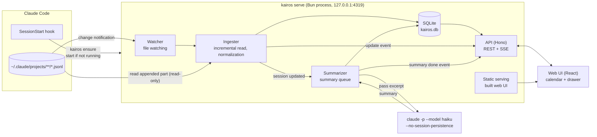
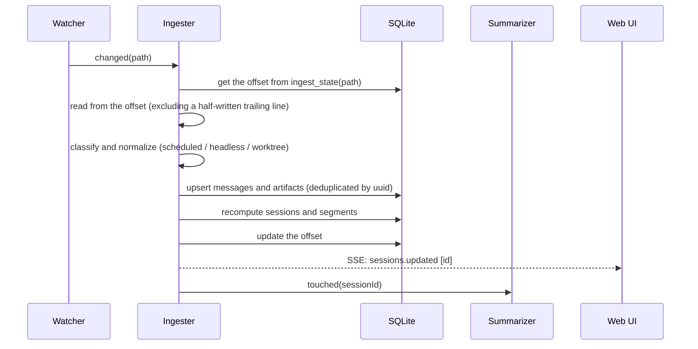
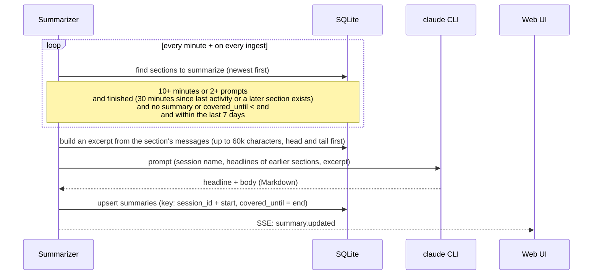

# Kairos Architecture

Last updated: 2026-10-05 / Related: [Requirements](requirements.md) / [Tasks](tasks.md)

## 1. Overview



There is only one process, `kairos serve`, which handles ingest, summaries, the API and static serving together.

## 2. Components

| Component | Responsibility | Main implementation |
|---|---|---|
| Launcher | `kairos ensure`: checks `/api/health` and, if there's no response, starts `kairos serve` detached. A PID file prevents double starts | `src/cli` |
| Watcher | Watches `~/.claude/projects` recursively and hands changed jsonl files to the Ingester. Bursts of changes are coalesced (debounce) | `fs.watch` (recursive) |
| Ingester | Reads only the appended part from the offset in `ingest_state`. A half-written trailing line is left for next time. Classifies, normalizes and stores records | `src/server/ingest` |
| Segmenter | Builds work blocks from the activity times of human-initiated turns (split at 15 minutes). Recomputed on every session update | `src/server/ingest/segments.ts` |
| Summarizer | Queues sessions that need summaries and runs `claude -p` one at a time | `src/server/summarize` |
| API | REST for the calendar, details, conversations, summaries and project settings, plus SSE for update notifications | Hono |
| Web UI | Week and day calendar, detail drawer, filters (projects, keywords, etc.). English by default, Japanese selectable (`src/web/src/i18n`) | React + Tailwind + shadcn/ui |

## 3. Ingest flow



### 3.1 Normalization rules

| Rule | Criterion |
|---|---|
| Human prompt | `type=user` and `origin.kind=human` (any `promptSource`; `sdk` is also human input, e.g. from the desktop app). Includes slash commands |
| Automatic-run turn | From a user record with `turnOrigin=scheduled` until the next human prompt. Set `messages.is_scheduled=1` and exclude from work-block computation. `task-notification` and `peer` don't change how a turn is treated |
| Headless session | Zero human prompts. Not shown on the calendar |
| Worktree | If the launch cwd is `<repo>/.claude/worktrees/<name>`, the project is `<repo>` and `<name>` becomes a secondary label. A later `relocated` / `worktree-state` only affects the secondary label |
| Title | `custom-title` > `agent-name` > `ai-title` > the first human prompt |
| Recap | Store `system/away_summary` and use it as a placeholder until the AI summary is ready |
| Tool output | Truncated to the first 4KB |
| Thinking and images | Not stored |
| Commit | A successful Bash call containing `git commit` |
| PR | A `pr-link` record. The title comes from `--title` of `gh pr create` and is linked by the URL in the result's `gitOperation.pr` |
| Token usage | Store the assistant record's `message.usage` in `usage`, one row per `message.id` (with the maximum `output_tokens`). Subagent usage goes into the parent session. Returned per work block as the sum within its time range |
| Activity | Counted from messages and artifacts within the work block's time range: outcomes (commits and PRs, up to 5 minutes after the end), files edited (distinct targets of Edit / Write, etc.), tool calls, subagents, stumbles (tool errors, interrupts, API errors), conversation compactions |
| Claude's working time and effort | Store `durationMs` of `system/turn_duration` in `turns`, and the response's `effort` in `usage.effort`. Copies in continued sessions are excluded by uuid |
| Cost | An estimate converted with the API price list (`src/server/pricing.ts`). It won't match what you actually pay when using a subscription |

The evidence for each rule and the fixture for each rule are collected in [tests/fixtures/README.md](../tests/fixtures/README.md).

The parser has a `PARSER_VERSION`. Files whose `ingest_state.parser_version` doesn't match are re-read if the original log still exists.

## 4. Summary flow

Summaries are per section (one calendar block). With real data, a single session splits into as many as 15 blocks, so per-session summaries would repeat the same headline.



- Concurrency is 1. On failure the reason is recorded and it retries up to 3 times after 1, 2 and 4 minutes
- For short sections (under 10 minutes and at most one prompt), only a headline is generated automatically. The body is stored in `summaries` as an empty string and returned by the API as no summary (`body: null`)
- The body of short sections and sections older than 7 days can be pushed to the priority queue with the button in the drawer (`POST /api/sessions/:id/sections/:start/summary`)
- Sections without a headline (older than 7 days, in progress, not yet generated) show `segments.fallback_title`, computed at ingest (the first prompt, or failing that the first line of Claude's last reply)
- The summary language is set with `--summary-lang <en|ja>` (default `en`). Changing it doesn't touch existing summaries; they can be regenerated from the drawer
- `claude` runs in a dedicated working directory with `--no-session-persistence`, `--tools ""`, `--strict-mcp-config` and `--setting-sources project` to eliminate side effects

## 5. API

| Method | Path | Description |
|---|---|---|
| GET | `/api/health` | Liveness check (used by the Launcher) |
| GET | `/api/calendar?from&to` | Sessions in the period and their sections (start, end, headline, prompt count, token usage, activity) |
| GET | `/api/spans?from&to` | Only the start, end and project of work blocks overlapping the period. Used for the "days with records" dots in the date picker; assigning to days is done in the UI's local time |
| GET | `/api/sessions/:id` | Session details (per-section summaries, artifacts, subagents) |
| GET | `/api/sessions/:id/messages?cursor&limit` | Paginated conversation |
| POST | `/api/sessions/:id/sections/:start/summary` | Push generating or regenerating a section's summary onto the priority queue (202) |
| GET | `/api/projects` | List of projects (color, hidden flag) |
| PATCH | `/api/projects/:id` | Change color or hidden |
| GET | `/api/events` | SSE (`sessions.updated` / `summary.updated` / `ingest.progress`) |

Write routes (POST / PATCH) require `Content-Type: application/json` and the same Origin. Every request's Host header must be `127.0.0.1` or `localhost`.

Request and response types live in `src/shared` and are shared by the server and the frontend.

## 6. Screen layout

```
┌──────────────────────────────────────────────────────────────┐
│ Kairos   [Week|Day]  ‹ Today ›  October 2026  W40  [Filter▾] │
├──────┬───────────────────────────────────┬───────────────────┤
│ Time │ Mon  Tue  Wed  Thu  Fri  Sat  Sun │ Detail drawer     │
│ 9:00 │ ┌──┐                              │ Headline          │
│      │ │Su│ ┌──┐                         │ Project, time     │
│10:00 │ │mm│ │  │                         │ ─ Summary ─       │
│      │ └──┘ └──┘                         │ Goal / Done …     │
│      │                                   │ ─ Conversation ─  │
│      │                                   │ ─ Commits, PRs ─  │
└──────┴───────────────────────────────────┴───────────────────┘
```

- Blocks that overlap in time are placed side by side, as in Google Calendar
- Blocks show the summary headline. If there isn't enough height, only the headline is shown, with the full text on hover
- The drawer is synced with the URL (`?session=`) and stays open across reloads

## 7. Directory layout

```
kairos/
├── docs/
├── src/
│   ├── cli/            # kairos serve / ensure / ingest / summarize
│   ├── server/
│   │   ├── db/         # schema, migrations, queries
│   │   ├── ingest/     # watcher, reader, parser, normalize, segments
│   │   ├── summarize/  # queue, digest, running claude
│   │   └── api/        # Hono routes, SSE, security middleware
│   ├── shared/         # API types and constants
│   └── web/            # React app (Vite); i18n/ holds the UI messages
├── tests/fixtures/     # anonymized jsonl samples
└── package.json
```

## 8. Storage locations

| Kind | Path |
|---|---|
| DB | `~/Library/Application Support/kairos/kairos.db` |
| Log | `~/Library/Logs/kairos/server.log` |
| PID | `~/Library/Application Support/kairos/kairos.pid` |
| Working directory for summaries | `~/Library/Application Support/kairos/summarizer/` |
