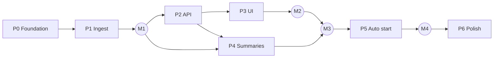

# Kairos Task Breakdown

Last updated: 2026-10-05 / Related: [Requirements](requirements.md) / [Architecture](architecture.md)

Size estimates: **S** = half a day or less, **M** = about a day, **L** = 2–3 days

## Milestones

| # | Milestone | State reached |
|---|---|---|
| M1 | Data in the DB | `kairos ingest` loads all logs into SQLite, and the session list can be checked from the CLI |
| M2 | Viewable on a calendar | Week and day views and the drawer work in the browser, with live updates |
| M3 | Summaries attached | Idle sessions get summaries automatically, which become block headlines |
| M4 | Usable every day | Starts automatically when Claude Code launches |

P3 (UI) and P4 (summaries) can proceed in parallel after P2.

## P0 Foundation

| ID | Task | Done when | Size |
|---|---|---|---|
| ✅ P0-1 | Create the Bun + TypeScript project (`src/{cli,server,shared,web}`), make `tsconfig` strict | `bun run typecheck` passes | S |
| ✅ P0-2 | Set up lint and formatting (Biome) and tests (`bun test`) | `bun run check` runs lint, types and tests together | S |
| ✅ P0-3 | Initial setup of Vite + React + Tailwind + shadcn/ui. In development, Vite proxies to the API | `bun run dev` starts an empty screen and the API together | S |
| ✅ P0-4 | Study the shape of real logs and build fixtures from fictional data (normal, `/loop`, headless, worktree, subagent, compaction, half-written line) | At least 7 kinds in `tests/fixtures/` | M |

## P1 Ingest (→ M1)

| ID | Task | Done when | Size |
|---|---|---|---|
| ✅ P1-1 | DB schema and migrations ([Requirements §6](requirements.md#6-data-model-draft)) | The latest schema is created from an empty DB and running twice doesn't break it | S |
| ✅ P1-2 | jsonl reader: incremental read from the offset, holding back a half-written trailing line | Tests for appends, half-written lines and file replacement pass | M |
| ✅ P1-3 | Record classification: human prompt / command / tool result / automatic run / notification / compaction | Every fixture record is classified as expected | M |
| ✅ P1-4 | Normalize and store: messages (tool output truncated to 4KB, thinking excluded), deduplication by uuid | Ingesting the same file twice doesn't change the counts | M |
| ✅ P1-5 | Project resolution: group worktrees with the parent repository | `.claude/worktrees/loop` belongs to `langgraph-demo` | S |
| ✅ P1-6 | Artifact extraction: successful `git commit`s and PR links | All commits and PRs in the fixtures are picked up | S |
| ✅ P1-7 | Segmenter: build work blocks excluding automatic-run turns | No blocks are created for automatic runs in the `/loop` fixture | S |
| ✅ P1-8 | Session aggregates: title, start, end, prompt count, state, headless detection | The headless fixture is excluded from the calendar | S |
| ✅ P1-9 | The `kairos ingest` command (full first ingest, progress display) and re-ingest via `PARSER_VERSION` | Can ingest all real logs (about 895MB). The second run reads only the difference and finishes within seconds | M |

## P2 API

| ID | Task | Done when | Size |
|---|---|---|---|
| ✅ P2-1 | Hono server skeleton and security middleware (Host validation, CSP, Origin and Content-Type checks on writes) | Tests that reject an invalid Host and a cross-origin POST pass | S |
| ✅ P2-2 | `GET /api/calendar` and `GET /api/projects` / `PATCH /api/projects/:id` | Fetching a week takes under 50ms | S |
| ✅ P2-3 | `GET /api/sessions/:id` and `/messages` (cursor pagination) | A conversation with over 1000 messages can be fetched in pages | S |
| ✅ P2-4 | Watcher and SSE (`/api/events`): file change → ingest → notification | Posting in an in-progress session delivers an event within seconds | M |
| ✅ P2-5 | Define API types in `src/shared` and use them in the frontend's fetch wrapper | Changing a type causes type errors on both the server and the frontend | S |

## P3 UI (→ M2)

| ID | Task | Done when | Size |
|---|---|---|---|
| ✅ P3-1 | Layout and theme (three areas: toolbar, calendar, drawer; light and dark; Japanese) | The theme switches to match the OS setting | S |
| ✅ P3-2 | Week grid (CSS Grid, current-time line, today highlighted, initial scroll to the busiest hours) | A week of blocks is drawn at the right position and height | M |
| ✅ P3-3 | Overlap layout: place blocks at the same time side by side | A time slot with 3 concurrent sessions is visible without overlap | M |
| ✅ P3-4 | Block display: project color, headline, truncation by height, full text on hover | The start of the headline is readable even for a short ~15-minute block | S |
| ✅ P3-5 | Day view, date navigation, back to today, keyboard shortcuts (←→ / t / Esc) | The selected session is kept when switching between week and day | S |
| ✅ P3-6 | Detail drawer: headline, metadata, summary, commits and PRs | Clicking a block opens it, synced with `?session=` in the URL | M |
| ✅ P3-7 | Conversation view: chat style, Markdown rendering (sanitized), collapsed tool calls, infinite scroll | Scrolling doesn't freeze even in long conversations | M |
| ✅ P3-8 | Project filter (show/hide, change color) | A hidden project stays hidden after reload | S |
| ✅ P3-9 | Live updates via SSE (blocks grow, summaries slot in) | Working with the screen open makes blocks grow | S |
| ✅ P3-11 | Summary layout: period totals with the change from the previous period, by day / through the day, by project, and what was done (F11); the list layout moved in as its table tab | The week's numbers match the list view's totals with the same filter | M |
| ✅ P3-10 | English UI with a Japanese option (`src/web/src/i18n`; "⋯" menu, saved per browser) | All UI copy comes from the en/ja dictionaries and English is the default | M |

## P4 Summaries (→ M3)

On 2026-10-05, the unit of summaries changed from sessions to sections (calendar blocks).

| ID | Task | Done when | Size |
|---|---|---|---|
| ✅ P4-1 | Build the excerpt: requests, replies and tool summaries in the section, up to 60k characters. If over, prefer the head and tail | Even long sections fit within the limit and include the first request and the final result | S |
| ✅ P4-2 | Wrapper for running `claude -p` (timeout, error formatting, flags that prevent side effects) | Running it doesn't add a session to the calendar. When not logged in, the error is returned | S |
| ✅ P4-3 | Summary queue: automatically queue finished sections from the last 7 days, skip short sections, concurrency 1, 3 retries | A summary appears 30 minutes after you stop working | M |
| ✅ P4-4 | Priority queue: request a summary from the drawer (short sections, older than 7 days, regenerate) | Opening an old section and pressing the button shows a summary | S |
| ✅ P4-5 | Detect stale summaries (`covered_until < end`) and show it in the UI | After a section continues, a note that work continued after the summary appears | S |
| ✅ P4-6 | Reflect section headlines in calendar blocks and the drawer (session flow) | Once a summary is attached, the block shows the headline | S |
| ✅ P4-7 | Tune the prompt (check headline and body quality on about 10 real examples; checked on 12 on 2026-10-05) | The headline alone tells you what the work was | S |
| ✅ P4-8 | Summary language setting (follows the UI language; `--summary-lang <en\|ja>` fixes it) | New summaries are written in the configured language; existing ones are kept | S |
| ✅ P4-9 | Recaps: per-project explanation of a period's work, written by `claude -p` from section summaries on request (`recaps` table, `/api/recaps`, stale detection) | A week's recap names its PRs and shows as stale once more work comes in | M |

## P5 Auto start (→ M4)

| ID | Task | Done when | Size |
|---|---|---|---|
| ✅ P5-1 | `kairos serve` (starts ingest → watching → summaries → API in order, logs to a file) | Starts and stops on its own and closes the DB correctly on exit | S |
| ✅ P5-2 | `kairos ensure` (health check, PID file, detached start) | Calling it 10 times in a row leaves only one process | S |
| ✅ P5-3 | SessionStart hook setup and instructions for installing the command with `bun link` | Launching Claude Code starts the server. The hook doesn't delay session start (returns within 100ms) | S |
| ✅ P5-4 | README (setup, usage, data locations, removal) | The README alone is enough to install on another machine | S |

## P6 Polish

| ID | Task | Done when | Size |
|---|---|---|---|
| ✅ P6-1 | Empty and error states (no logs, ingesting, summary failed) | Each state tells you what to do next | S |
| P6-2 | Performance check (first ingest time, start to display, DB size) | Start to display within 1 second. Results recorded in docs | S |
| ✅ P6-3 | Note about `cleanupPeriodDays` in the README (with Kairos the display doesn't disappear, but sessions whose original logs are gone can't be re-read even after bumping `PARSER_VERSION`) | The README mentions it | S |

## Deferred (Requirements §3.2)

Monthly heat map / Codex support / notes and tags (search and reports were added on 2026-10-05)
