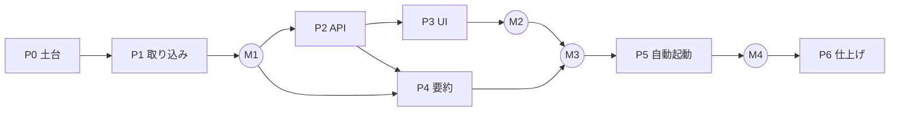

# Kairos タスク分解

最終更新: 2026-10-05 / 関連: [要件定義](requirements.md) / [構成](architecture.md)

規模の目安: **S** = 半日以内、**M** = 1 日程度、**L** = 2〜3 日

## マイルストーン

| # | マイルストーン | 到達状態 |
|---|---|---|
| M1 | データが DB に入る | `kairos ingest` で全ログが SQLite に入り、CLI でセッション一覧を確認できる |
| M2 | カレンダーで見られる | ブラウザで週・日表示とドロワーが動き、ライブ更新される |
| M3 | 要約が付く | 止まったセッションに要約が自動で付き、ブロックの見出しになる |
| M4 | 毎日使える | Claude Code を起動すると自動で立ち上がる |

P3（UI）と P4（要約）は P2 の後に並行して進められる。

## P0 土台

| ID | タスク | 完了条件 | 規模 |
|---|---|---|---|
| ✅ P0-1 | Bun + TypeScript のプロジェクト作成（`src/{cli,server,shared,web}`）、`tsconfig` の strict 化 | `bun run typecheck` が通る | S |
| ✅ P0-2 | Lint・フォーマット（Biome）とテスト（`bun test`）の設定 | `bun run check` で lint・型・テストが一括で走る | S |
| ✅ P0-3 | Vite + React + Tailwind + shadcn/ui の初期設定。開発時は Vite から API へプロキシ | `bun run dev` で空の画面と API が同時に起動する | S |
| ✅ P0-4 | 実ログの形を調べ、架空データで fixture を作る（通常・`/loop`・headless・worktree・サブエージェント・compaction・書きかけ行） | `tests/fixtures/` に 7 種類以上そろう | M |

## P1 取り込み（→ M1）

| ID | タスク | 完了条件 | 規模 |
|---|---|---|---|
| ✅ P1-1 | DB スキーマとマイグレーション（[要件定義 §6](requirements.md#6-データモデル案)） | 空の DB から最新スキーマが作られ、2 回実行しても壊れない | S |
| ✅ P1-2 | jsonl リーダー: offset からの差分読み込み、末尾の書きかけ行の保留 | 追記・書きかけ・ファイル置き換えのテストが通る | M |
| ✅ P1-3 | レコード分類: 人のプロンプト / コマンド / ツール結果 / 自動実行 / 通知 / compaction | fixture の全レコードが期待どおりに分類される | M |
| ✅ P1-4 | 正規化と保存: messages（ツール出力 4KB 切り詰め、thinking 除外）、uuid での重複排除 | 同じファイルを 2 回取り込んでも件数が変わらない | M |
| ✅ P1-5 | プロジェクト解決: worktree を親リポジトリにまとめる | `.claude/worktrees/loop` が `langgraph-demo` に属する | S |
| ✅ P1-6 | 成果物の抽出: 成功した `git commit` と PR リンク | fixture のコミット・PR がすべて拾える | S |
| ✅ P1-7 | Segmenter: 自動実行ターンを除いて作業ブロックを作る | `/loop` の fixture で自動実行分のブロックができない | S |
| ✅ P1-8 | セッション集計: タイトル・開始・終了・プロンプト数・状態、headless の判定 | headless の fixture がカレンダー対象外になる | S |
| ✅ P1-9 | `kairos ingest` コマンド（初回の全件取り込み、進捗表示）と `PARSER_VERSION` による再取り込み | 実環境の全ログ（約 895MB）を取り込める。2 回目は差分のみで数秒以内に終わる | M |

## P2 API

| ID | タスク | 完了条件 | 規模 |
|---|---|---|---|
| ✅ P2-1 | Hono サーバーの骨組みとセキュリティ middleware（Host 検証・CSP・書き込み時の Origin と Content-Type 検証） | 不正な Host と別 Origin の POST が拒否されるテストが通る | S |
| ✅ P2-2 | `GET /api/calendar` と `GET /api/projects` / `PATCH /api/projects/:id` | 1 週間分の取得が 50ms 以内 | S |
| ✅ P2-3 | `GET /api/sessions/:id` と `/messages`（カーソルでページング） | 1000 件超の会話を分割して取得できる | S |
| ✅ P2-4 | Watcher と SSE（`/api/events`）: ファイル変更 → 取り込み → 通知 | 作業中のセッションに発言すると数秒以内にイベントが届く | M |
| ✅ P2-5 | `src/shared` に API の型を定義し、フロントの fetch ラッパーで使う | 型を変えるとサーバーとフロントの両方で型エラーになる | S |

## P3 UI（→ M2）

| ID | タスク | 完了条件 | 規模 |
|---|---|---|---|
| ✅ P3-1 | レイアウトとテーマ（ツールバー・カレンダー・ドロワーの 3 領域、ライト・ダーク、日本語） | OS の設定に合わせてテーマが切り替わる | S |
| ✅ P3-2 | 週表示グリッド（CSS Grid、現在時刻線、今日の強調、初期表示で作業の多い時間帯へスクロール） | 1 週間分のブロックが正しい位置・高さに描かれる | M |
| ✅ P3-3 | 重なりレイアウト: 同時刻のブロックを横に並べる | 同時に 3 セッション動いていた時間帯が重ならずに見える | M |
| ✅ P3-4 | ブロックの表示: プロジェクト色、見出し、高さに応じた省略、ホバーで全文 | 15 分程度の短いブロックでも見出しの先頭が読める | S |
| ✅ P3-5 | 日表示と、日付移動・今日へ戻る・キーボード操作（←→ / t / Esc） | 週と日を切り替えても選択中のセッションが保たれる | S |
| ✅ P3-6 | 詳細ドロワー: 見出し・メタ情報・要約・コミットと PR | ブロックをクリックすると開き、URL の `?session=` と同期する | M |
| ✅ P3-7 | 会話ビュー: チャット形式、Markdown 描画（サニタイズ）、ツール呼び出しの折りたたみ、無限スクロール | 長い会話でも固まらずにスクロールできる | M |
| ✅ P3-8 | プロジェクト絞り込み（表示・非表示、色の変更） | 非表示にしたプロジェクトがリロード後も消えたまま | S |
| ✅ P3-9 | SSE によるライブ更新（ブロックの伸長、要約の差し込み） | 画面を開いたまま作業するとブロックが伸びていく | S |

## P4 要約（→ M3）

2026-10-05 に、要約の単位をセッションからセクション（カレンダーのブロック）に変更した。

| ID | タスク | 完了条件 | 規模 |
|---|---|---|---|
| ✅ P4-1 | 抜粋の生成: セクション内の依頼・返答・ツール概要を最大 6 万字に。超えたら先頭と末尾を優先 | 長いセクションでも上限内に収まり、最初の依頼と最後の結果が含まれる | S |
| ✅ P4-2 | `claude -p` の実行ラッパー（タイムアウト、エラー整形、副作用を防ぐフラグ） | 実行してもカレンダーにセッションが増えない。未ログイン時にエラー内容が返る | S |
| ✅ P4-3 | 要約キュー: 終わったセクション & 直近 7 日を自動で積む、短いセクションは除く、並列数 1、再試行 3 回 | 作業を止めて 30 分後に要約が付く | M |
| ✅ P4-4 | 優先キュー: ドロワーから要約を依頼（短いセクション・7 日より前・再生成） | 古いセクションを開いてボタンを押すと要約が表示される | S |
| ✅ P4-5 | 要約が古いことの検知（`covered_until < end`）と UI 上の表示 | セクションが続いた後に「要約の後も作業が続いています」が出る | S |
| ✅ P4-6 | セクションの見出しをカレンダーのブロックとドロワー（セッションの流れ）に反映 | 要約が付くとブロックの表示が見出しに変わる | S |
| P4-7 | プロンプトの調整（実データ 10 件程度で見出し・本文の質を確認） | 見出しだけで作業内容がわかる | S |

## P5 自動起動（→ M4）

| ID | タスク | 完了条件 | 規模 |
|---|---|---|---|
| ✅ P5-1 | `kairos serve`（取り込み → 監視 → 要約 → API を順に起動、ログをファイルに出力） | 単独で起動・終了でき、終了時に DB を正しく閉じる | S |
| ✅ P5-2 | `kairos ensure`（health 確認、PID ファイル、デタッチ起動） | 連続で 10 回呼んでもプロセスは 1 つだけ | S |
| ✅ P5-3 | SessionStart hook の設定と、`bun link` によるコマンドのインストール手順 | Claude Code を起動するとサーバーが立ち上がる。hook がセッション起動を遅らせない（100ms 以内に戻る） | S |
| ✅ P5-4 | README（セットアップ、使い方、データの場所、削除方法） | README だけで別の環境に導入できる | S |

## P6 仕上げ

| ID | タスク | 完了条件 | 規模 |
|---|---|---|---|
| P6-1 | 空の状態・エラー状態（ログなし、取り込み中、要約失敗）の表示 | 各状態で次に何をすればよいかが表示される | S |
| P6-2 | 性能確認（初回取り込み時間、起動から表示まで、DB サイズ） | 起動から表示まで 1 秒以内。結果を docs に記録 | S |
| ✅ P6-3 | `cleanupPeriodDays` についての注意を README に追記（Kairos があれば表示は消えないが、元ログが消えたセッションは `PARSER_VERSION` を上げても読み直せないこと） | README に記載がある | S |

## 後回し（要件定義 §3.2）

全文検索 / 日次・週次レポート / 月表示ヒートマップ / Codex 対応 / メモ・タグ
